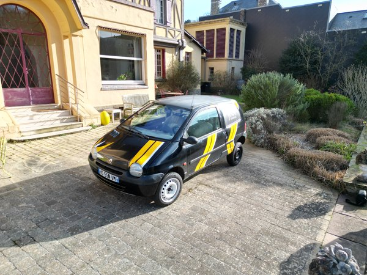

# Contenu de nos communications

Nos communications contiendront des nouvelles sous forme de texte ainsi que quelques photos des moments les plus marquants capturés.

Nous voulons vous faire vivre notre aventure au plus près en essayant de vous transmettre des nouvelles le plus régulièrement possible. Mais ce ne sera peut-être pas si simple : dans le désert, sans internet, ou tout simplement occupés à réparer la voiture, nous ne pourrons pas envoyer de messages tous les jours. Nous pensons que la fréquence des newsletters sera d'une fois tous les 2 ou 3 jours.

Merci pour votre suivi, ça nous donne de la force. À bientôt !

Manon & Quentin  
Brocconotte

