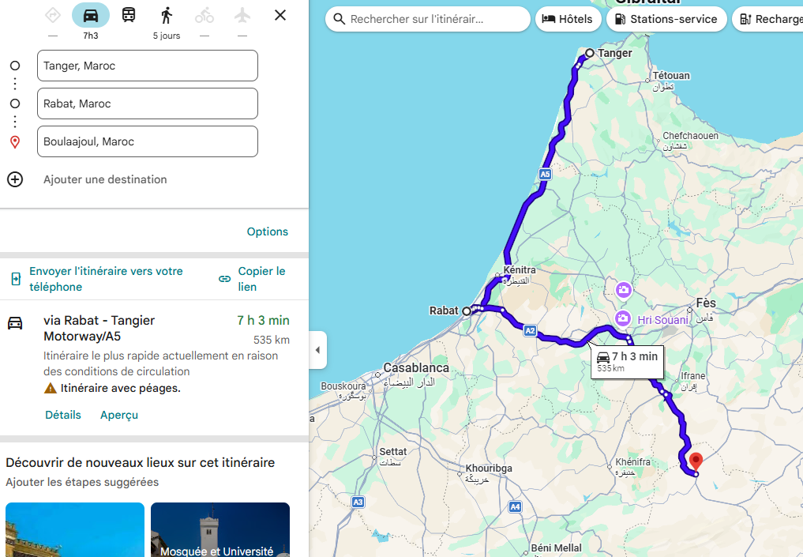

# Prochaines étapes : le Maroc, nous voilà !

Le réveil va piquer ! Demain, lundi, le départ est fixé à 5 h du matin. Nous embarquerons sur le ferry qui nous fera traverser la Méditerranée jusqu'à Tanger.

Une fois de l'autre côté et les formalités douanières passées, une longue route nous attendra jusqu'à notre première destination marocaine : *Boulaajoul*.

Cette route, nous la connaissons un peu. En effet, nous avions passé quelques jours au Maroc avant Noël pour rendre visite à des amis. Nous allons emprunter la même autoroute jusqu'à Rabat, soit près de la moitié du trajet du jour.

Pas encore de pistes sablonneuses ni de désert à l'horizon, mais notre Twingo sera déjà bien loin de son port d'attache. L'aventure africaine commence pour de bon !

Suite à cela, ce seront des étapes plus sportives, avec de la piste, des cailloux et du sable. Mais surtout le début des rencontres et de notre impact humanitaire sur place...