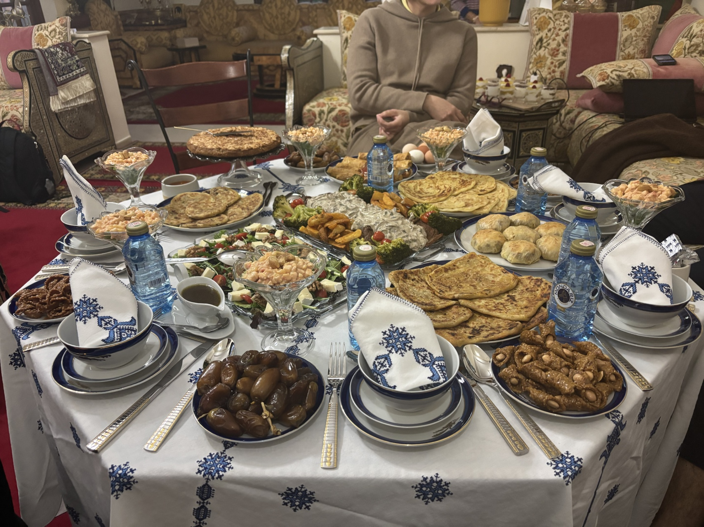

# Tourisme et bons moments au Maroc

Le Twingo Maroco Tour est terminé. Nous avons passé notre dernière soirée avec nos copains pilotes de Twingo. La plupart d'entre eux sont repartis directement vers le nord pour rejoindre la France rapidement.

Depuis Marrakech, nous avons décidé de prendre la direction plein-ouest afin de visiter la côte et la petite ville d'Essaouira.

Essaouira nous a fait une excellente impression avec sa grande plage, son port de pêche typique et très animé, ainsi que sa médina très sympathique.

Le lendemain, nous sommes retournés à Marrakech pour visiter les jardins de Majorelle, mais surtout pour profiter de notre coffre de Twingo désormais presque vide et dénicher de petites pépites dans le fameux souk.

Puis, direction le nord, où nous avons retrouvé des amis, Ouidad et Amine, dans la capitale du Maroc, à Rabat, pour célébrer ensemble le Ftour : la rupture du jeûne. Nous étions en pleine période de Ramadan, et notre amie nous avait gentiment invités chez elle pour partager ce moment. Quel délice !

C'était notre dernière soirée au Maroc. Nous garderons un souvenir incroyable de ce pays et de ses habitants ! Choukran et à bientôt.