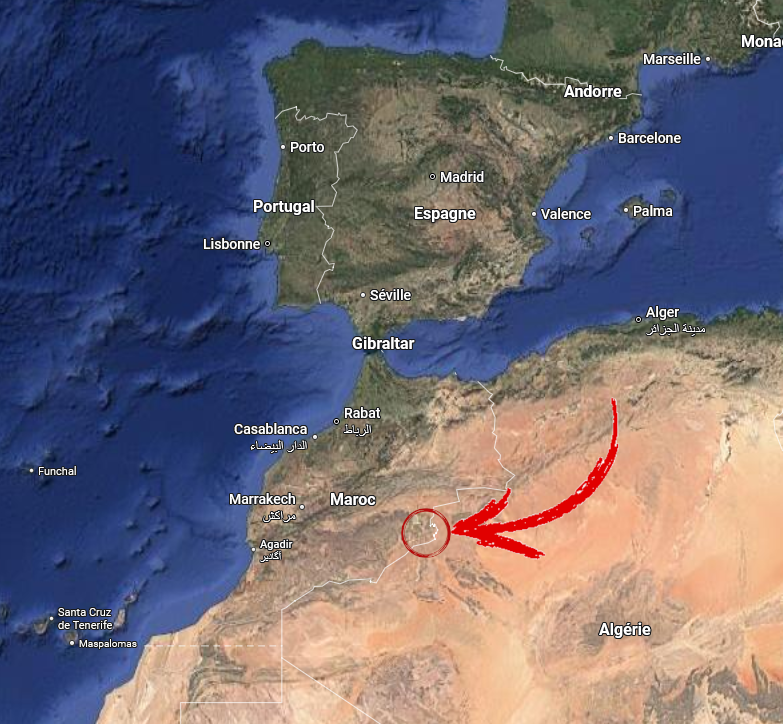

# Rétrospective sur le désert

Cela fait environ un mois que nous sommes rentrés, et la traversée du désert reste le souvenir le plus fort de notre séjour au Maroc.

Nous étions basés à Merzouga, un petit village animé par le tourisme des dunes, situé à la lisière du Sahara et proche de la frontière algérienne, dans l'est du pays. Nous y sommes arrivés par la route et avons rejoint notre campement organisé par l’équipe locale.

Nous sommes restés trois nuits dans ce campement. Chacun avait sa grande tente avec un matelas double et de l’espace pour ranger les valises et les cartons de dons. En plus des tentes de couchage, le camp proposait des tentes avec toilettes, des tentes avec douche et une grande tente centrale où nous prenions tous ensemble le petit-déjeuner et le dîner.

Merzouga est relativement touristique et propose des aménagements modernes : hôtels, restaurants, campings, locations de motos, de quads, de dromadaires, et surtout des stations-service pour notre Twingo.

Le désert était autour de nous. Les dunes surplombaient littéralement notre campement, offrant une lumière magique au coucher du soleil. Chaque matin, nous partions à 8h pour parcourir de superbes paysages et profiter des pistes les plus folles du voyage.

À partir du camp, nous avons réalisé plusieurs boucles en traversant des chemins divers pour rejoindre des villages isolés : roches, bancs de sable et pistes. Nous avions rendez-vous avec ces communautés pour distribuer les dons. Ce fut un moment intense et humain.

C'est en traversant ces étendues désertiques au volant de notre Twingo que l'adaptation que nous lui avions apportée a pris tout son sens. Prendre un peu de vitesse sur ces pistes, parfois anciennement arpentées par le Paris-Dakar, a été le summum du plaisir mécanique. Mais une roue au mauvais endroit pouvait être synonyme de gros dégâts...

La vie au camp était un spectacle en soi : apéros à côté des Twingo, dégustation de tajine, spectacle de glaoui, chants traditionnels marocains. Cette convivialité a été l’un des grands plaisirs de l’aventure.

Ce séjour dans le désert restera parmi les plus belles étapes de notre road trip, avec des paysages à couper le souffle et des souvenirs inoubliables.

