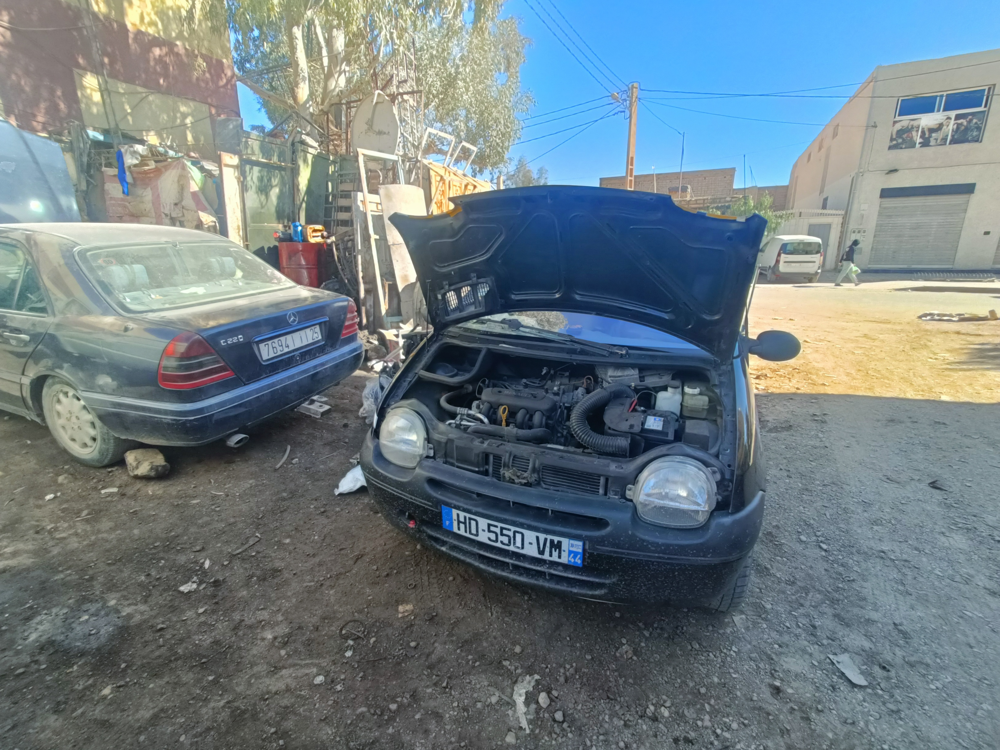
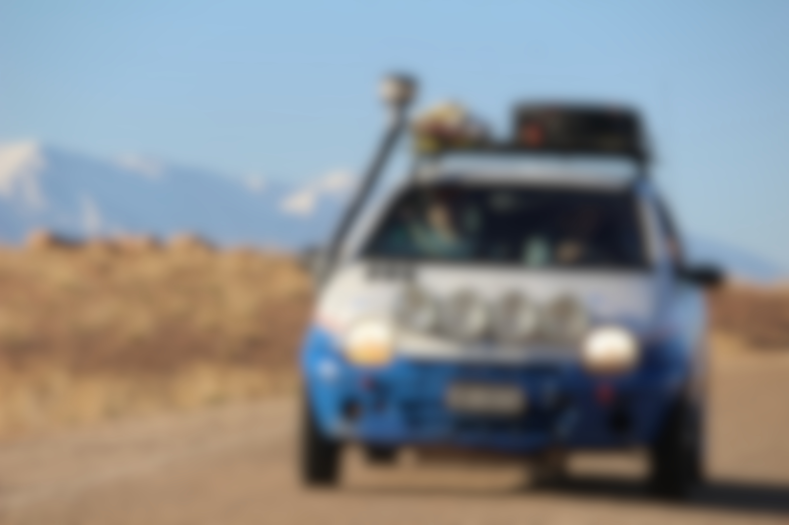

# Le bilan mécanique

Au total, entre le 20 février et le 8 mars, nous avons parcouru environ XXX kilomètres.

Après tous ces kilomètres, surtout dans le désert et sur des routes très cassantes, la voiture a quand même beaucoup travaillé. La bonne nouvelle, c’est que la Twingo a tenu le coup, mais elle a tout de même laissé quelques traces de son effort.

## Le maître cylindre de frein

Après notre passage à Bordeaux, nous avons remarqué un comportement anormal au freinage. En appuyant longtemps sur la pédale, la puissance du freinage diminuait petit à petit, comme si la voiture se relâchait.

Avec le temps, ce phénomène s’est accentué malgré le « pompage » de la pédale. Nous avons donc dû nous arrêter dans un garage au Maroc pour faire diagnostiquer le problème. Le verdict : le maître cylindre de frein était fatigué.

Il a été remplacé, mais pas par une pièce d’origine. Le garagiste a monté une pièce de récupération provenant d’une autre voiture, ce qui a rendu l’opération étonnamment mémorable. La Twingo s’en est sortie, nous avons pu poursuivre l'aventure.

## Les plaques de protection

Avant le départ, nous avions posé une plaque en aluminium sous le moteur et des protections en acier autour du réservoir. Ces éléments ont bien joué leur rôle, surtout la plaque moteur, qui est très proche du sol.

Sur les routes caillouteuses du désert, la plaque avant a beaucoup frotté et s’est profondément rayée. Elle a même reculé légèrement sur son support de fixation, ce qui montre bien la violence des chocs que nous avons encaissés.

Heureusement, ces protections ont évité des dommages plus graves au moteur et au réservoir. Elles méritent un ajustement et un renfort.

## Le sable et la poussière

Le désert a transformé la Twingo en véritable aspirateur à sable. Partout où nous sommes passés, le sable et la poussière se sont infiltrés sous le capot, dans l’habitacle et autour des organes mécaniques.

Nous allons donc prendre le temps de nettoyer soigneusement le véhicule.

---

Bilan : la voiture a souffert, mais elle a tenu. Il reste des réparations à faire, surtout pour le freinage.

Nous allons aussi réfléchir à quelques améliorations pratiques, inspirées des autres voitures que nous avons croisées sur la route. À suivre...

