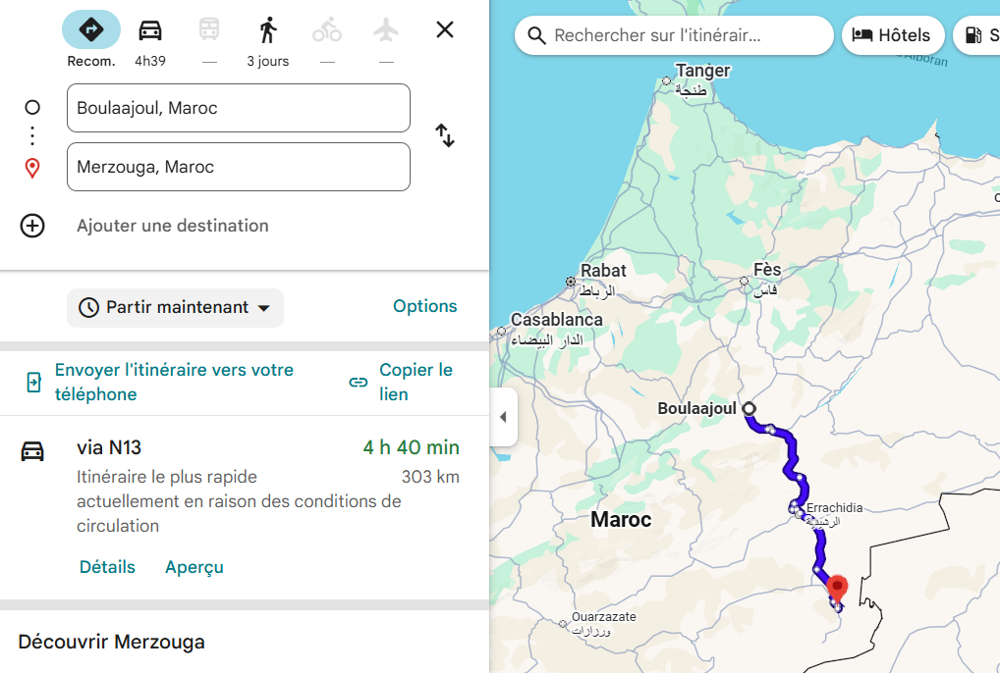

# Arrivée à Merzouga : Premières pistes et paysages grandioses !

Pour atteindre Merzouga, nous avons avalé près de 300 km de route et, surtout, de pistes ! C'est dans ces conditions que la préparation de notre Twingo prend tout son sens. Un grand merci à nos suspensions renforcées qui ont fait des merveilles !

Chaque kilomètre nous a offert des paysages à couper le souffle, nous confirmant que l'aventure valait chaque coup de volant.

Nous voilà enfin arrivés à Merzouga, où nous établissons notre camp de base pour les trois prochaines nuits. Le repos est bien mérité avant de nouvelles péripéties !  

