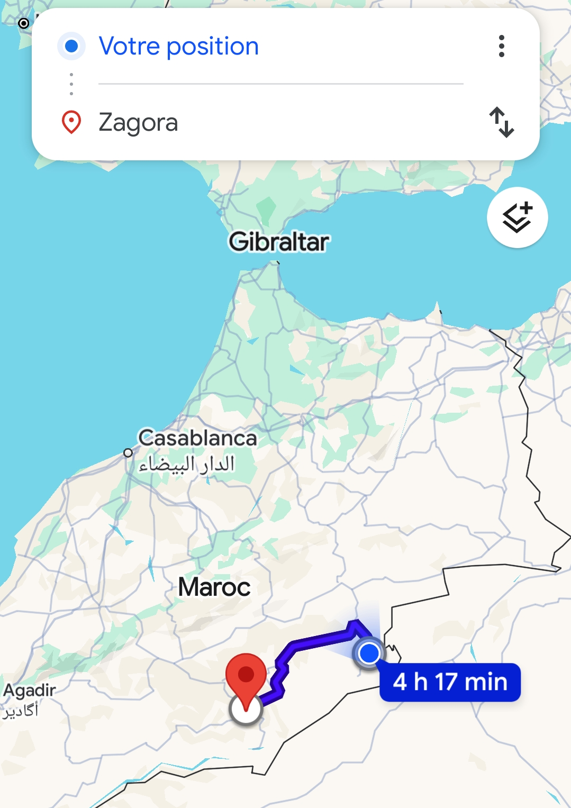

# Prochaines étapes : Toujours plus loin dans notre mission

Notre mission à Merzouga n'est pas terminée. Nous allons continuer à visiter d'autres associations, des villages nomades et des écoles pour distribuer le reste des dons. 

Une fois notre objectif humanitaire ici accompli, nous reprendrons la route en direction de Zagora, une autre porte mythique du désert marocain. L'aventure est loin d'être finie !

